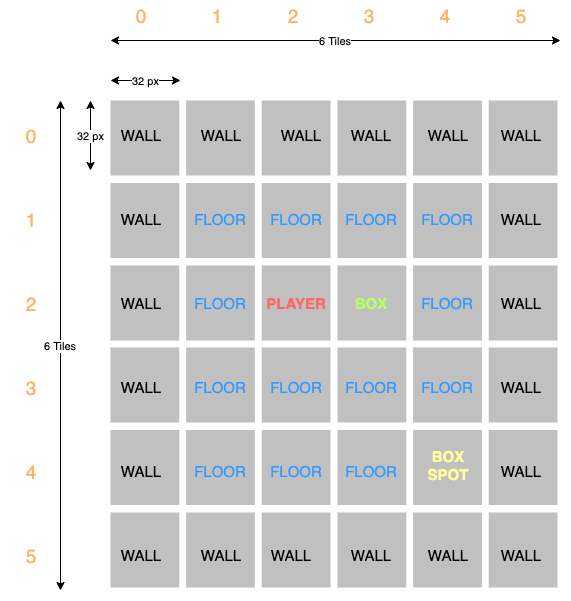

# Architecture

Now that we have set up our basic project and we've discussed ECS, let's think how we are going to structure our game. This is how a classic Sokoban game looks like. We have a player, we can move the player using `UP`, `DOWN`, `LEFT`, `RIGHT` arrow keys, we have boxes which the player can move and walls which he/she can't. And the goal of the game is to move the boxes to the positions indicated by the black squares (which we are going to call box spots). When we've moved all boxes on their spots, we win. 

Now that we know what we're making, let's think about how we might structure this. 

The **map** in this example is a 6x6 grid based on 32 pixel tiles. That means each tile ix 32x32 pixels, and we have 6 tiles width and 6 tiles height. These dimensions (6x6) were chosen for simplicity but we can always create new maps with different layouts, the only thing that will stay constant here is the tile size (32x32).

The map contains different types of things: walls, floors, boxes, a player and box spots. These are going to be our **entities**. 

All these entities have different characteristics. They all have a position, for example the top left corner wall is at (0, 0), the player is at (2, 2) and the box is at (3, 2). The other thing they have in common is that they all need to be rendered somehow. The wall might need to look differently than the floor, but we can have that be a parameter to this rendering characteristic. The other characteristic is that some of our entities can be moved. For example, the boxes and the player can move, but not the wall or the floors. These 3 characteristics are our **components**, they are what the entities are made of.

We are then going to have the following entities, made up by the following components:
1. Player entity
    * Position
    * Renderable
    * Movable

1. Wall entity
    * Position
    * Renderable

1. Floor entity
    * Position
    * Renderable

1. Box entity
    * Position
    * Renderable

1. Box spot entity
    * Position
    * Renderable

You might have noticed that we have only discussed the E and C in ECS, but fear not, we will implement the systems as we go. 

Now that we have a plan, let's get to implementing in the next chapter!