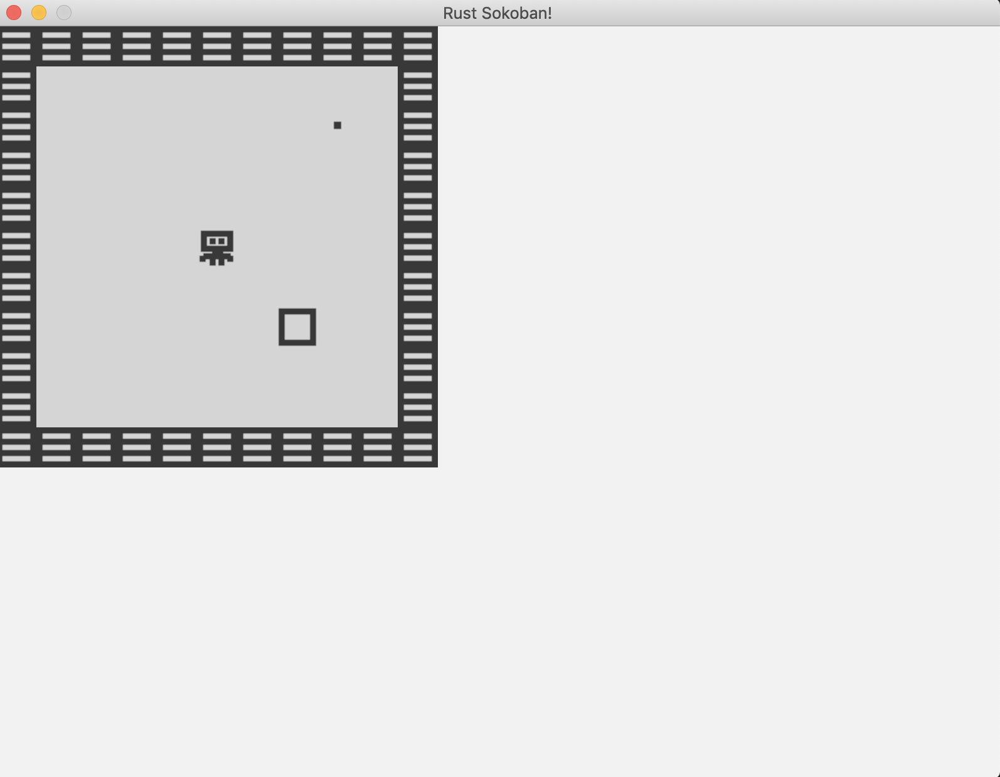
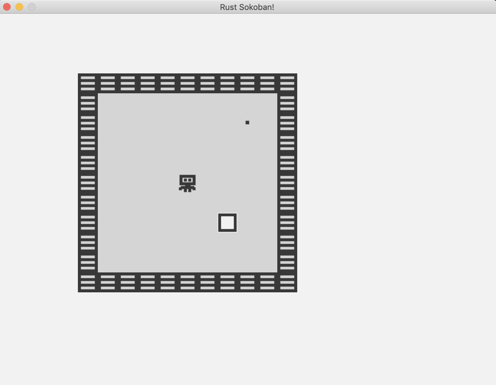

# Map

It's time to create our first basic map. The basic idea is:
* we'll start with a 10x10 grid of tiles
* we'll put walls on the borders
* we'll put the player at 5,5
* we'll put one box at 7,7
* we'll put the box spot at 8,2
* floors for the whole map

Here is the code to generate this basic map.

```rust
pub fn create_map(world: &mut World) {
    for x in 0..=MAP_WIDTH {
        for y in 0..=MAP_HEIGHT {
            // create walls on the borders
            if x == 0 || x == width || y == 0 || y == height {
                create_wall(
                    world,
                    Position {
                        x: TILE_WIDTH * x as f32,
                        y: TILE_WIDTH * y as f32,
                    },
                );
            } else {
                // check if it's any other type of entity
                let create = match (x, y) {
                    (5, 5) => create_player,
                    (7, 7) => create_box,
                    (8, 2) => create_box_spot,
                    _ => create_floor,
                };
                create(
                    world,
                    Position {
                        x: TILE_WIDTH * x as f32,
                        y: TILE_WIDTH * y as f32,
                    },
                );
            }
        }
    }
}

// Initialize the level - replace the dummy implementation
// of initialize level we had before
pub fn initialize_level(world: &mut World) {
    create_map(world);
}
```

There are a few new things here:
* for loops with ranges - ` for x in 0..=MAP_WIDTH` this is much like a regular for loop where we go from 0 to width (the `=` means it's inclusive)
* matches - matches are like if else statements on steroids. with a match we can do much more complex pattern match, in this case we are matching the x and y values and we return a different function reference. 
 
If we run this code we should now see a pretty map.



One final touch, let's make the map a bit more centered. I took this opportunity to also refactor and simplify `create_map`. Now handing the borders is also done part of the match so we were able to simplify the code. Notice how we are now using a fancier match where we match on `(x, y)` with a condition: `if x == 0 || x == width || y == 0 || y == height`.


```rust
pub fn create_map(world: &mut World) {
    let (offset_x, offset_y) = (4, 3); // make the map somewhat centered

    for x in 0..=MAP_WIDTH {
        for y in 0..=MAP_HEIGHT {
            let create = match (x, y) {
                (x, y) if x == 0 || x == MAP_WIDTH || y == 0 || y == MAP_HEIGHT => create_wall,

                (5, 5) => create_player,
                (7, 7) => create_box,
                (8, 2) => create_box_spot,
                _ => create_floor,
            };
            create(
                world,
                Position {
                    x: TILE_WIDTH * (x + offset_x) as f32,
                    y: TILE_WIDTH * (y + offset_y) as f32,
                    z: 0 // we will get the z from the factory functions
                },
            );
        }
    }
}
```

This code works but has a small subtle bug. We are not creating floors below the player, box or box spots. The player and the box will move, and when they do we'll notice there is no floor beneath them. So we need to make sure we have floors everywhere.

Here's some code with the fix.

```rust
// Adding Clone and Copy here to our Position struct 
// to be able to get implicit copies, otherwise we'll have to
// call clone all over the place.
#[derive(Debug, Component, Clone, Copy)]
#[storage(VecStorage)]
pub struct Position {
    x: u8,
    y: u8,
    z: u8
}

// Here is the updated implementation of create_map. The biggest difference is that
// now for every map position we call create_floor along with any other create for
// other objects.
pub fn create_map(world: &mut World) {
    let (offset_x, offset_y) = (4, 3); // make the map somewhat centered
    let no_op = |_world: &mut World, _position: Position| {};

    for x in 0..=MAP_WIDTH {
        for y in 0..=MAP_HEIGHT {

            // Create the position at which to create something on the map
            let position = Position {
                x: TILE_WIDTH * (x + offset_x) as f32,
                y: TILE_WIDTH * (y + offset_y) as f32,
                z: 0 // we will get the z from the factory functions
            };

            // Figure out what object we should create
            let create = match (x, y) {
                (x, y) if x == 0 || x == MAP_WIDTH || y == 0 || y == MAP_HEIGHT => create_wall,

                (5, 5) => create_player,
                (7, 7) => create_box,
                (8, 2) => create_box_spot,
                _ => no_op,
            };

            // Create floor and create the special objects
            create_floor(world, position);
            create(world, position);
        }
    }
}
```




Next up we'll start working on the gameplay, making the player move and so on. Come along for the ride!

Full code below. 

```rust
use ggez;
use ggez::graphics;
use ggez::graphics::DrawParam;
use ggez::graphics::Image;
use ggez::nalgebra as na;
use ggez::{conf, event, Context, GameResult};
use specs::{
    join::Join, Builder, Component, ReadStorage, RunNow, System, VecStorage, World, WorldExt,
};

use std::path;

const TILE_WIDTH: f32 = 32.0;
const MAP_WIDTH: u8 = 10;
const MAP_HEIGHT: u8 = 10;

// Components
#[derive(Debug, Component, Clone, Copy)]
#[storage(VecStorage)]
pub struct Position {
    x: u8,
    y: u8,
    z: u8
}

#[derive(Component)]
#[storage(VecStorage)]
pub struct Renderable {
    path: String,
}

#[derive(Component)]
#[storage(VecStorage)]
pub struct Wall {}

#[derive(Component)]
#[storage(VecStorage)]
pub struct Player {}

#[derive(Component)]
#[storage(VecStorage)]
pub struct Box {}

#[derive(Component)]
#[storage(VecStorage)]
pub struct BoxSpot {}

// Systems
pub struct RenderingSystem<'a> {
    context: &'a mut Context,
}

// System implementation
impl<'a> System<'a> for RenderingSystem<'a> {
    // Data
    type SystemData = (ReadStorage<'a, Position>, ReadStorage<'a, Renderable>);

    fn run(&mut self, data: Self::SystemData) {
        let (positions, renderables) = data;

        // Clearing the screen (this gives us the backround colour)
        graphics::clear(self.context, graphics::Color::new(0.95, 0.95, 0.95, 1.0));

        // Get all the renderables with their positions and sort by the position z
        // This will allow us to have entities layered visually.
        let mut rendering_data = (&positions, &renderables).join().collect::<Vec<_>>();
        rendering_data.sort_by(|&a, &b| a.0.z.partial_cmp(&b.0.z).expect("expected comparison"));

        // Iterate through all pairs of positions & renderables, load the image
        // and draw it at the specified position.
        for (position, renderable) in rendering_data.iter() {
            // Load the image
            let image = Image::new(self.context, renderable.path.clone()).expect("expected image");

            // draw
            let draw_params = DrawParam::new().dest(na::Point2::new(position.x, position.y));
            graphics::draw(self.context, &image, draw_params).expect("expected render");
        }

        // Finally, present the context, this will actually display everything
        // on the screen.
        graphics::present(self.context).expect("expected to present");
    }
}

// This struct will hold all our game state
// For now there is nothing to be held, but we'll add
// things shortly.
struct Game {
    world: World,
}

// This is the main event loop. ggez tells us to implement
// two things:
// - updating
// - rendering
impl event::EventHandler for Game {
    fn update(&mut self, _context: &mut Context) -> GameResult {
        Ok(())
    }

    fn draw(&mut self, context: &mut Context) -> GameResult {
        // Render game entities
        {
            let mut rs = RenderingSystem { context };
            rs.run_now(&self.world);
        }

        Ok(())
    }
}

// Register components with the world
pub fn register_components(world: &mut World) {
    world.register::<Position>();
    world.register::<Renderable>();
    world.register::<Player>();
    world.register::<Wall>();
    world.register::<Box>();
    world.register::<BoxSpot>();
}

// Create a wall entity
pub fn create_wall(world: &mut World, position: Position) {
    world
        .create_entity()
        .with(Position {z: 10, ..position})
        .with(Renderable {
            path: "/images/wall.png".to_string(),
        })
        .with(Wall {})
        .build();
}

pub fn create_floor(world: &mut World, position: Position) {
    world
        .create_entity()
        .with(Position {z: 5, ..position})
        .with(Renderable {
            path: "/images/floor.png".to_string(),
        })
        .build();
}

pub fn create_box(world: &mut World, position: Position) {
    world
        .create_entity()
        .with(Position {z: 10, ..position})
        .with(Renderable {
            path: "/images/box.png".to_string(),
        })
        .with(Box {})
        .build();
}

pub fn create_box_spot(world: &mut World, position: Position) {
    world
        .create_entity()
        .with(Position {z: 9, ..position})
        .with(Renderable {
            path: "/images/box_spot.png".to_string(),
        })
        .with(BoxSpot {})
        .build();
}

pub fn create_player(world: &mut World, position: Position) {
    world
        .create_entity()
        .with(Position {z: 10, ..position})
        .with(Renderable {
            path: "/images/player.png".to_string(),
        })
        .with(Player {})
        .build();
}

pub fn create_map(world: &mut World) {
    let (offset_x, offset_y) = (4, 3); // make the map somewhat centered
    let no_op = |_world: &mut World, _position: Position| {};

    for x in 0..=MAP_WIDTH {
        for y in 0..=MAP_HEIGHT {

            // Create the position at which to create something on the map
            let position = Position {
                x: TILE_WIDTH * (x + offset_x) as f32,
                y: TILE_WIDTH * (y + offset_y) as f32,
                z: 0 // we will get the z from the factory functions
            };

            // Figure out what object we should create
            let create = match (x, y) {
                (x, y) if x == 0 || x == MAP_WIDTH || y == 0 || y == MAP_HEIGHT => create_wall,

                (5, 5) => create_player,
                (7, 7) => create_box,
                (8, 2) => create_box_spot,
                _ => no_op,
            };

            // Create floor and create the special objects
            create_floor(world, position);
            create(world, position);
        }
    }
}

// Initialize the level
pub fn initialize_level(world: &mut World) {
    create_map(world);
}

pub fn main() -> GameResult {
    let mut world = World::new();
    register_components(&mut world);
    initialize_level(&mut world);

    // Create a game context and event loop
    let context_builder = ggez::ContextBuilder::new("rust_sokoban", "sokoban")
        .window_setup(conf::WindowSetup::default().title("Rust Sokoban!"))
        .window_mode(conf::WindowMode::default().dimensions(800.0, 600.0))
        .add_resource_path(path::PathBuf::from("./resources"));

    let (context, event_loop) = &mut context_builder.build()?;

    // Create the game state
    let game = &mut Game { world };
    // Run the main event loop
    event::run(context, event_loop, game)
}
```
