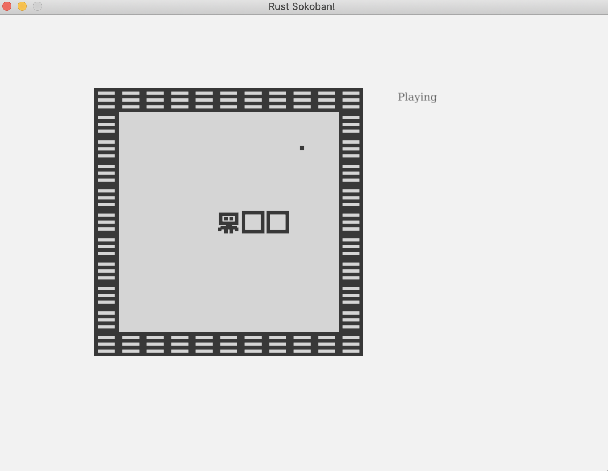

# Winning

Now that we can push boxes around, the final thing to make this a proper game is to allow you to win. Winning is simply placing all the boxes on their spots. 

## Gameplay resource
Let's add a game state as a resource and display it on the screen. For now we can either be playing or won. 

```rust
pub enum GameplayState {
    Playing,
    Won,
}
```

We will also implement a default value for gameplay state which will be Playing.

```rust
impl Default for GameplayState {
    fn default() -> Self { 
        Self::Playing 
    }
}
```

And finally, we create a struct to hold all the gameplay data and register that as a resource.

```rust
#[derive(Default)]
pub struct Gameplay {
    pub state: GameplayState
}

// Register resources
pub fn register_resources(world: &mut World) {
    world.insert(InputQueue::default());
    world.insert(Gameplay::default());
}
```

## Render gameplay state
Let's figure out how to render text with ggez.

```rust
impl RenderingSystem<'_> {
    pub fn draw_text(&mut self, text_string: &str, x: f32, y: f32) {
        let text = graphics::Text::new(text_string);
        let destination = na::Point2::new(x, y);
        let color = Some(Color::new(0.0, 0.0, 0.0, 1.0));
        let dimensions = na::Point2::new(0.0, 20.0);

        graphics::queue_text(self.context, &text, dimensions, color);
        graphics::draw_queued_text(
            self.context,
            graphics::DrawParam::new().dest(destination),
            None,
            graphics::FilterMode::Linear,
        )
        .expect("expected drawing queued text");
    }
}
```

The code here is pretty straight-forward and pretty much a rip off from ggez's more complicated text rendering examples. Basically given a string and an x and y, render that text at that position with some default colour and text dimensions.

Next we'll grab the game state and render it with the function we just wrote.

```rust
// System implementation
impl<'a> System<'a> for RenderingSystem<'a> {
    // Data
    type SystemData = (
        Read<'a, Gameplay>, // add this here
        ReadStorage<'a, Position>, 
        ReadStorage<'a, Renderable>
    );

    fn run(&mut self, data: Self::SystemData) {
        let (gameplay, positions, renderables) = data;
        // add gameplay here 

        // .......
        for (position, renderable) in rendering_data.iter() {
            // .......
        }

        // Render text
        self.draw_text(&gameplay.state.to_string(), 525.0, 80.0);

        // Finally, present the context, this will actually display everything
        // on the screen.
        graphics::present(self.context).expect("expected to present");
    }
}
```

Notice how we are calling `gameplay.state.to_string()`. If we compile the code like this we'll notice it complains about a missing ToString trait implementation.

```
    = help: items from traits can only be used if the trait is implemented and in scope
    = note: the following trait defines an item `to_string`, perhaps you need to implement it:
            candidate #1: `std::string::ToString`
```

This is because we are telling it to convert an enum into a string and Rust doesn't implemnent anything by default for this purpose. So it's easy, we need to tell it what to do. The following code implements the Display trait (which is implemented in terms of ToString), and esentially tells rust for every value of the enum which string it should use.

```rust
impl Display for GameplayState {
    fn fmt(&self, fmt: &mut fmt::Formatter) -> fmt::Result {
        fmt.write_str(
            match self {
                GameplayState::Playing => "Playing",
                GameplayState::Won => "Won"
            }
        )?;
        Ok(())
    }
}
```

Now if we compile, we should see the text appearing to the right of our map.



Finally, let's implement a system that can change the game state to winning.


