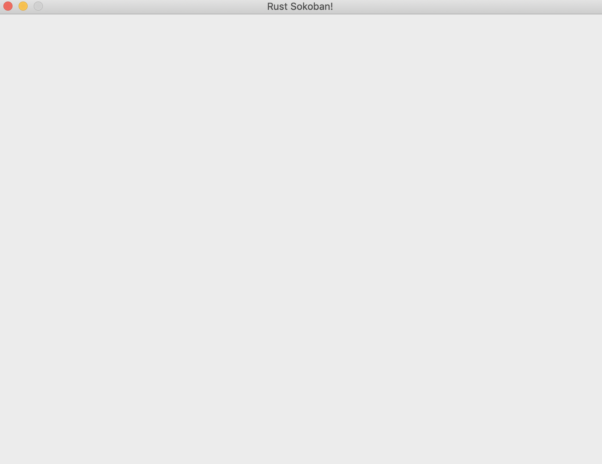

# Project setup

Let's install [rustup](https://www.rust-lang.org/tools/install), this will install Rust and the Rust compiler for us. Now let's check everything is installed correctly using these two commands; the versions shouldn't matter too much so if yours are different don't worry about it.

```
$ rustc --version
rustc 1.40.0
$ cargo --version
cargo 1.40.0
```

## Creating a project

Cargo is Rust's package manager, and we will use it to create our game project. Change into a directory where you'd like the game to live and run the following command, with this we will be creating a new project called `rust-sokoban` using cargo.

```
$ cargo init rust-sokoban
```

After the command has run you should see the following folder structure.

```
├── src
│   └── main.rs
└── Cargo.toml
```

We can now run `cargo run` in this directory and we should see something like this.

```
$ cargo run
   Compiling rust-sokoban v0.1.0
    Finished dev [unoptimized + debuginfo] target(s) in 1.30s
     Running `../rust-sokoban/target/debug/rust-sokoban`
Hello, world!
```

## Making it a game
It's time to make this basic hello world project into a game! We are going to use [ggez](https://ggez.rs/) which is one of the popular 2D game engines out there.

Remember that `Cargo.toml` file we saw in our directory? That file is used for dependency management, so if we want to use any Rust crates we'll have to add them there. Let's add [ggez](https://github.com/ggez/ggez) as one of our dependencies.

> **_MORE:_**  Read more about Cargo and toml files [here](https://doc.rust-lang.org/book/ch01-03-hello-cargo.html).

```toml
[dependencies]
ggez = "0.5.1"
```

Now let's run `cargo run` again and you should see something like this. It should take slightly longer this time as it will be fetching these new dependencies from [crates.io](https://crates.io), then compiling them and finally linking them into our lib.

```
cargo run
    Updating crates.io index
    Downloaded ....
    ....
    Compiling ....
    ....
    Finished dev [unoptimized + debuginfo] target(s) in 2m 15s
    Running `.../rust-sokoban/target/debug/rust-sokoban`
    Hello, world!
```

> **_NOTE:_** If you're following this guide on Ubuntu, you might need to install a few
more dependencies. If this step fails and you see errors related to `alsa` and `libudev`, install them by running
```sudo apt-get install libudev-dev libasound2-dev```.

Now let's actually use ggez in the main file and set up our window. This is just the simplest example of a ggez program that will give us a window with nothing else. Copy and paste this into the `main.rs` file and run again.

```rust
{{#include ../code/rust-sokoban-c01-01/src/main.rs}}
```

You should see something like this.



## Basic concepts and syntax

Now that we have our basic window, let's delve into the code we have in main and understand the underlying Rust concepts and syntax.

### Importing
Hopefully this should be a familiar concept from other languages you might know, but to bring types and namespaces into the scope from our dependent packages (or crates) we simply `use` them.

```rust
// this will import conf, event, Context and GameResult from the ggez namespace
{{#include ../code/rust-sokoban-c01-01/src/main.rs:1}}
```

### Declaring a struct
```rust
{{#include ../code/rust-sokoban-c01-01/src/main.rs:4:7}}
```

> **_MORE:_**  Read more about structs [here](https://doc.rust-lang.org/book/ch05-00-structs.html).


### Implementing a trait
A trait is much like an interface in other languages, it allows us to associate some behaviour with a particular type. In this case we want to implement the EventHandler trait and add that behaviour to our Game struct.

```rust
{{#include ../code/rust-sokoban-c01-01/src/main.rs:9:23}}
```

> **_MORE:_**  Read more about traits [here](https://doc.rust-lang.org/book/ch10-02-traits.html).


### Functions
We are also learning how to declare functions in Rust.

```rust
{{#include ../code/rust-sokoban-c01-01/src/main.rs:14:17}}
```

You might be wondering what the self is, in this case self means that the update function is a member function, it belongs to an instance of the game struct and it cannot be called in a static context. You might also be wondering what the `&mut` is. Mut means that the update function is allowed to make changes to the game struct.

> **_MORE:_**  Read more about functions [here](https://doc.rust-lang.org/book/ch03-03-how-functions-work.html).


After that gentle intro to Rust syntax and code, we are now ready to move on! See you in the next section!

> **_CODELINK:_**  You can see the full code in this example [here](https://github.com/iolivia/rust-sokoban/tree/master/code/rust-sokoban-c01-01).
